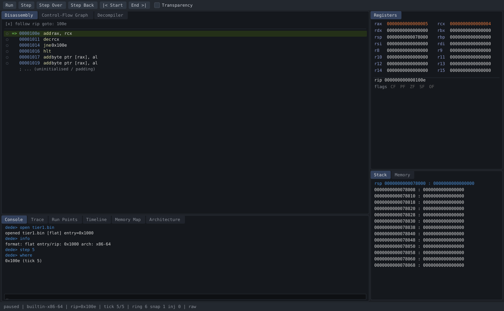
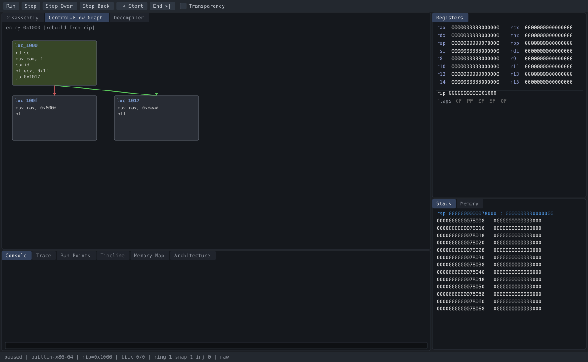
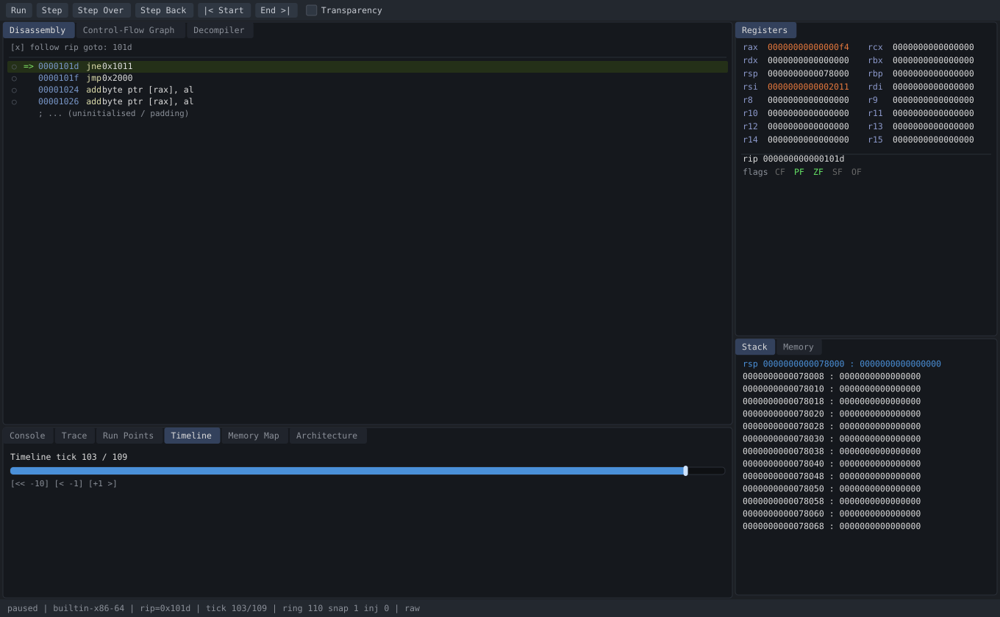
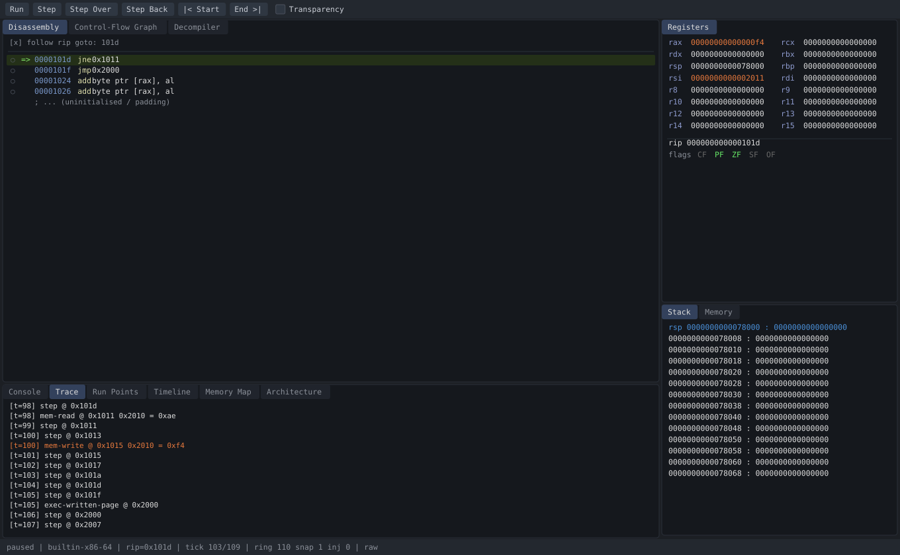

# The dede workspace (GUI)

dede's optional desktop front end is a **Vulkan + Dear ImGui** docked workspace.
It binds to the engine through the same `IAnalysisEngine` interface the CLI uses,
so every panel shows live engine state and every button drives a real Command —
the UI holds no analysis logic of its own and can be swapped without touching the
core.

## Rendering these images

The GUI needs a display and a GPU, which a headless CI container does not have, so
these are **not** screen captures and they are **not** mock-ups. They are rendered
by `dede-shot`, which boots a real `AnalysisSession`, runs a tutorial sample, and
draws the workspace — menu bar, Disassembly, Registers, Stack, Control-Flow Graph,
Trace, Timeline, status bar — to SVG using the engine's live output and the GUI's
own colour palette. Every address, register value, basic block, edge, stack slot
and trace event below is what the engine actually produced.

```bash
./build.sh                 # or: cmake --build build --target dede-shot
./build/dede-shot docs/img # regenerates docs/img/dede-ui-*.svg
```

## Overview — stepping an arithmetic loop (tier 1)



The default docked layout: **Disassembly** fills the centre (tabbed with
*Control-Flow Graph* and *Decompiler*); **Registers** and **Stack** stack down the
right column; **Console** (tabbed with *Trace*, *Run Points*, *Timeline*, *Memory
Map*, *Architecture*) runs along the bottom; a status bar reports phase, backend,
`rip`, tick, and timeline ring/snapshot/injected counts.

Here tier 1's `add rax, rcx / dec rcx / jne` loop has been stepped five times:
`rip` sits on the `add`, and `rax` (=5) / `rcx` (=4) are highlighted orange because
they changed since the sample loaded. The top toolbar carries Run / Step / Step
Over / Step Back / |< Start / End >| and a Transparency toggle.

## Control-flow graph — an anti-VM check (tier 4)



The CFG view builds basic blocks and typed edges from the **live byte image**, so
it stays correct even after self-modification. Tier 4's entry block runs
`rdtsc → cpuid → bt ecx, 0x1f → jb`: the hypervisor-present bit decides the branch.
The **green** edge (taken) and **red** edge (not-taken) lead to the two outcomes —
`mov rax, 0xdead` (VM detected) versus `mov rax, 0x600d` (clean). The block holding
`rip` is tinted green. Pan and zoom are live in the real GUI.

## Time-travel — stepping backwards through a decrypt loop (tier 5)



Tier 5 decrypts a second stage in place, then `jmp`s into it. Here the sample was
run forward to completion (tick 109) and then **stepped back six instructions** to
tick 103 — the Timeline panel shows `103 / 109` with the scrubber mid-track. `rip`
is back inside the decrypt loop (`jne 0x1011`, then `jmp 0x2000` into the revealed
stage). `rax` and `rsi` are orange: their values differ from where the scrubber
will land next. Stepping back is exact, not re-simulated-from-start.

## Event trace — watching code rewrite itself (tier 5)



The Trace panel is an Observer on the engine's event bus. Reading the same tier 5
session, it records the decrypt loop byte-by-byte: a `mem-read` of the encrypted
byte at `0x2010`, then a `mem-write` of the decrypted value `0xf4` back to the same
address (highlighted, because it is a write) — i.e. the program editing its own
future instructions, captured as data. Syscalls show up green; every row is a real
`Event` with its tick, kind, pc and address.

## Panels at a glance

| Panel | Shows | Backed by |
|-------|-------|-----------|
| Disassembly | linear disasm from `rip`, breakpoints, `=>` cursor | `disassemble()`, `run_points()` |
| Control-Flow Graph | basic blocks + typed edges, live-image based | `build_cfg()` |
| Decompiler | pseudo-C of the selected range | `decompile()` |
| Registers | 16 GPRs + `rip` + flags, changed values highlighted | `read_reg()`, `rflags()` |
| Stack | telescoped stack from `rsp`, symbol annotations | `read_mem()`, `symbols()` |
| Memory | hex/ASCII dump, follows a value | `read_mem()` |
| Console | the full CLI, in-window | the `Shell` over the same engine |
| Trace | live execution/memory/syscall events | `history()` Observer |
| Run Points | breakpoints, watchpoints, conditional/macro points | `run_points()` |
| Timeline | tick scrubber + step-back controls | `timeline_stats()`, `seek()` |
| Memory Map | mapped regions with perms | `memory_map()` |
| Architecture | subsystems and the design patterns each carries | `architecture()` |

Because the front end only ever calls `IAnalysisEngine`, the same session can be
driven from the CLI, this GUI, or a future TUI/web view interchangeably.
