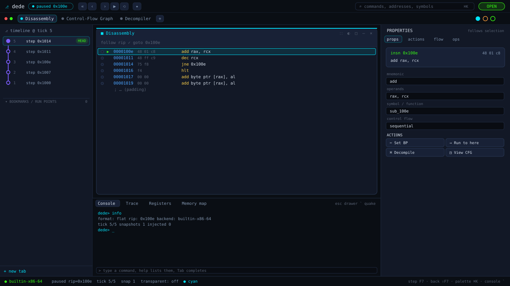
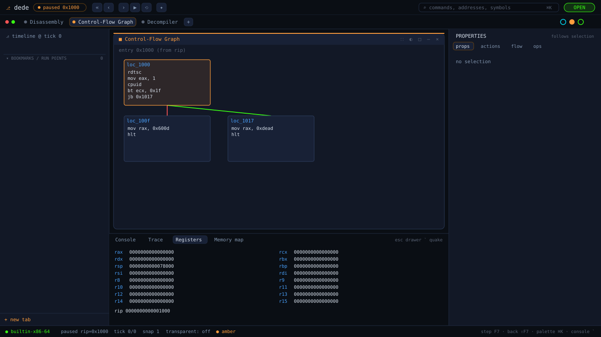
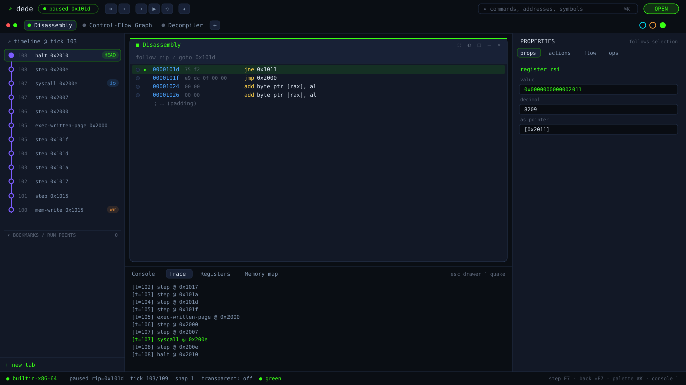
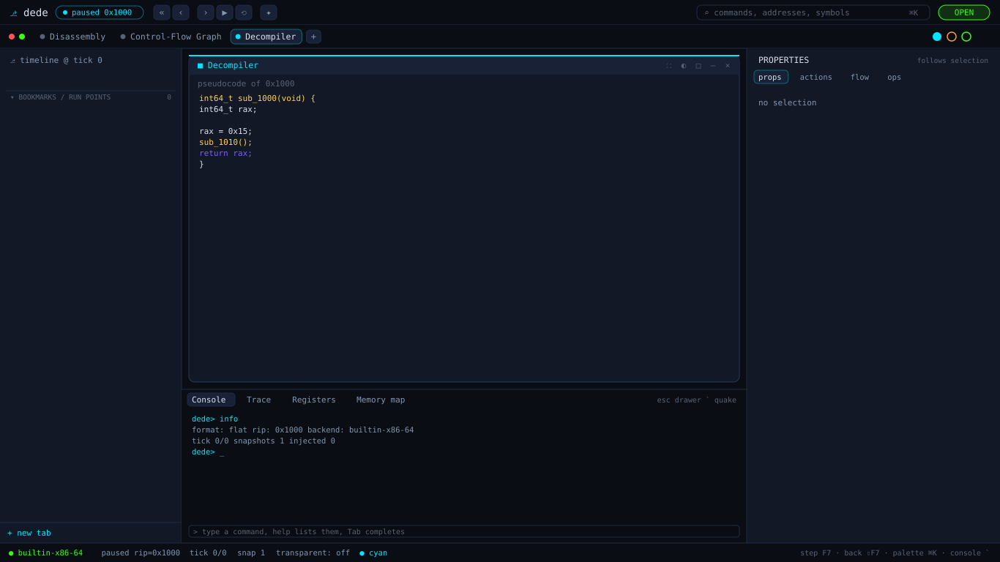

# The dede workspace (GUI)

dede's desktop front end is a **Vulkan + Dear ImGui** application built on a
modular, git-tool-style shell: a contribution **Registry** + feature **modules** +
interchangeable **painter backends**. The architecture is documented in
[UI_REDESIGN.md](UI_REDESIGN.md); this page is the visual tour.

## Rendering these images

The desktop GUI needs a display and a GPU, which a headless CI container does not
have, so these are **not** screen captures and **not** mock-ups. They are rendered
by `dede-shot`, which boots a real `AnalysisSession`, builds the UI kernel with its
registered modules, and draws the **entire shell** through the SVG painter — the
exact same `Shell` and panel code the ImGui backend runs on the desktop. Only the
painter differs. Every address, register, basic block, timeline node, and trace
event is live engine output.

```bash
./build.sh                 # or: cmake --build build --target dede-shot
./build/dede-shot docs/img # regenerates docs/img/ui-shell-*.svg
```

## Overview — stepping a loop (tier 1)



The git-tool-style shell: a title bar with the **dede** logo, a live **state chip**
(`paused 0x100e`), the time-travel toolbar (step back / step / run / restart), a
command-palette search, and OPEN. Below it the workspace **tab strip** (Disassembly
/ Control-Flow Graph / Decompiler) with the **theme-accent ovals** (cyan/amber/
green). The left column is dede's **timeline history graph** — the direct analog of
git-tool's commit graph, because time-travel *is* a history: each executed tick is
a node on the spine, HEAD is the current tick, and events get badges. The centre is
the **Disassembly** panel with window chrome; the right is the **Properties
inspector** that *follows the selection* (here the `add rax, rcx` instruction, with
its mnemonic/operands/symbol/control-flow fields and an actions grid); the bottom is
the **quake drawer** (Console / Trace / Registers / Memory map).

## Control-flow graph (tier 4, amber theme)



Switching the centre tab to the CFG renders tier 4's real anti-VM check
(`rdtsc → cpuid → bt → jb`) with typed edges — the whole chrome restyles to the
amber accent by swapping one theme token. The quake drawer shows the live registers.

## Time-travel (tier 5, green theme)



After running tier 5 to completion and **stepping back**, the timeline graph shows
the recorded events (`halt`, `syscall`, `exec-written-page`, `mem-write` — each
badged), the disassembly is back inside the decrypt loop, the **Trace** drawer lists
the self-modifying events, and the inspector **follows the selected `rsi` register**
(value, decimal, as-pointer). Selection drives the inspector with no wiring between
panels — they only share the Context.

## Decompiler (tier 2)



The decompiler view renders whatever `IDecompiler` the session carries (the native
decompiler + type-system backend is a separate work stream — see
[DECOMPILER.md](DECOMPILER.md)).

## Why it's built this way

Every panel above is a self-contained module that registers a `Manifest`; the shell
draws purely from the registry. Adding a panel is one file, re-skinning is swapping
a theme, and the same code renders headlessly (SVG) or live (ImGui). That modularity
— and the ability to verify the UI without a GPU — is the point.
